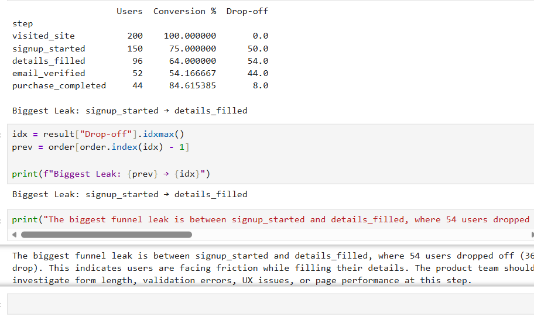
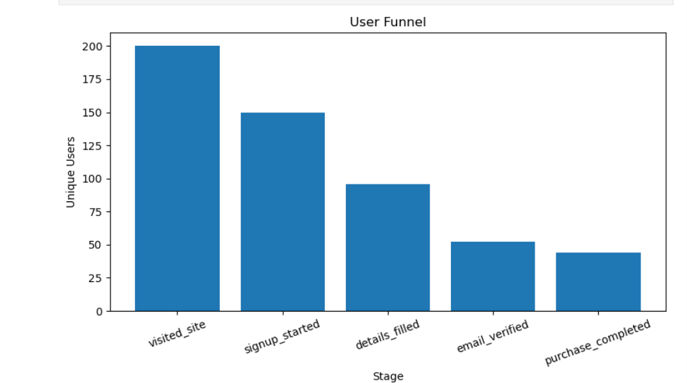
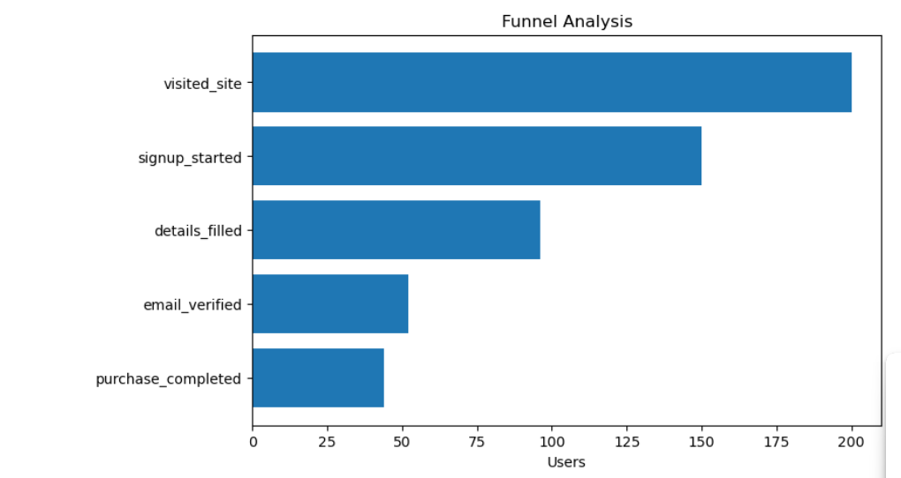
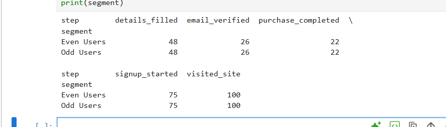
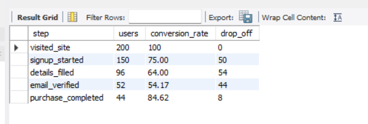
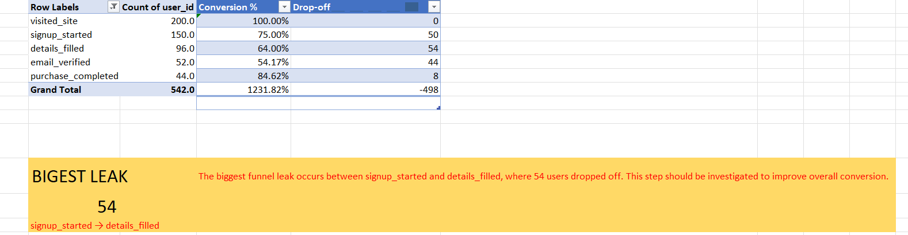

# funnaloa
A data analytics project that performs funnel analysis on user event data using Python, SQL, and Excel. Calculates conversion rates, identifies the biggest funnel leak, and provides actionable business insights.
# Funnel Analysis

This project analyzes a user signup and checkout funnel using Python (Pandas), SQL, and Excel.

## Objective
- Calculate the number of unique users at each funnel stage.
- Compute conversion rates between consecutive stages.
- Identify the stage with the highest drop-off.
- Generate business insights to improve the user journey.

## Tools Used
- Python (Pandas)
- SQL
- Microsoft Excel

## Funnel Stages
- Visited Site
- Signup Started
- Details Filled
- Email Verified
- Purchase Completed

## Analysis Performed
- Unique user count per stage
- Conversion rate calculation
- Drop-off analysis
- Biggest funnel leak identification

## Key Insight
The highest user drop-off occurs between **Signup Started** and **Details Filled**, indicating that this stage should be optimized to improve overall conversion.

## Skills Demonstrated
- Data Cleaning
- Pandas
- SQL (CTEs, Window Functions)
- Excel Pivot Tables
- Business Analytics
- Funnel Analysis
Key Findings
## Results

| Stage | Users | Conversion |
|-------|------:|-----------:|
| visited_site | 200 | 100% |
| signup_started | 150 | 75% |
| details_filled | 96 | 64% |
| email_verified | 52 | 54.17% |
| purchase_completed | 44 | 84.62% |

### Biggest Funnel Leak

signup_started → details_filled

Users Lost: 54

## Project Structure

├── funnel_analysis.ipynb
├── funnel_analysis.sql
├── funnel_analysis.xlsx
├── funnel_events_sample.csv
├── pythonout.png
├── sql1op.png
├── sql2op.png
├── excelop.png
└── README.md

• Total stages analyzed: 5
• Calculated unique users at each stage
• Computed stage-to-stage conversion rates
• Identified the biggest funnel leak between Signup Started and Details Filled
• Demonstrated the same analysis using Python, SQL, and Excel
## Python Output

## SQL Output

## Excel Output

The largest drop-off occurs between Signup Started and Details Filled. This suggests users experience friction while completing the registration form. Reducing the number of required fields, improving form validation, and simplifying the user interface could increase completion rates. Monitoring this step after implementing changes would help measure the impact on overall funnel conversion.

📊 Funnel Visualization

⏱ Average Time Between Stages

⚠ Automatic Biggest Drop-off Detection

👥 Segment-wise Conversion Analysis

💡 Business Recommendation
